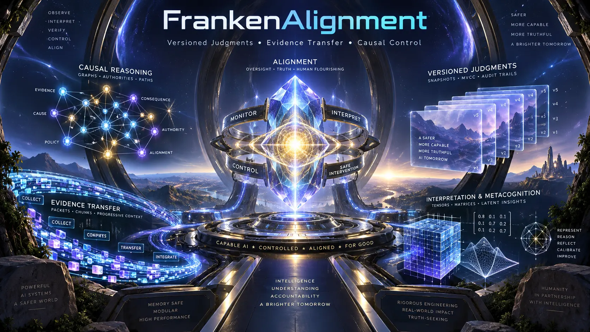

# franken_alignment

<div align="center">
  
</div>

<div align="center">

[](./LICENSE)
[](https://doc.rust-lang.org/edition-guide/rust-2024/)
[](./rust-toolchain.toml)
[](https://github.com/rust-secure-code/safety-dance/)
[](https://github.com/Dicklesworthstone)
[](./COMPREHENSIVE_PLAN_FOR_THE_DESIGN_OF_FRANKENALIGNMENT.md)

**Evidence-carrying control for powerful, potentially untrusted agents. Pure Rust. Structured concurrency. Versioned judgment. Economical introspection.**

</div>

```bash
# What runs today, from a source checkout (see Installation & local verification):
git clone https://github.com/Dicklesworthstone/franken_alignment
cd franken_alignment
RCH_REQUIRE_REMOTE=1 rch exec -- cargo +nightly-2026-09-07 test --locked -p fa-reference
RCH_REQUIRE_REMOTE=1 rch exec --base HEAD --clean-overlay --no-overlay -- cargo +nightly-2026-09-07 run --locked -p xtask -- check
```

> **A note on tense (read this first).** This README is written in the **present tense, as if the entire design in [`COMPREHENSIVE_PLAN_FOR_THE_DESIGN_OF_FRANKENALIGNMENT.md`](./COMPREHENSIVE_PLAN_FOR_THE_DESIGN_OF_FRANKENALIGNMENT.md) is fully realized**: the target state where every performance and safety gate is green and every subsystem is live. This is a deliberate choice. It lets the document describe the *finished* system so it gets **trued-up in place as milestones land** (Gates G0→G6 in [§21 of the plan](./COMPREHENSIVE_PLAN_FOR_THE_DESIGN_OF_FRANKENALIGNMENT.md#21-delivery-sequence-and-convergence-gates)) rather than rewritten from scratch later. Where the plan itself stages something as an open research hypothesis or future gate, the README says so plainly. Everything else below is the spec of the system this repository builds. The accompanying reference crate in [`crates/fa-reference`](./crates/fa-reference) models selected core logical semantics in pure safe Rust; [`IMPLEMENTATION_STATUS.md`](./IMPLEMENTATION_STATUS.md) is the exact statement of what exists and what has executed.

The reference now binds explicit tokenizer, policy and model epochs to the entire helper input and tests independent stream-prefix/closure obligations through public APIs. The [373-test execution receipt](artifacts/execution/2026-09-08-input-frontier-receipt.json) records the bounded result and its authentication and performance limits.

---

## TL;DR

**The problem.** Every conventional approach to AI alignment is compromised by fragile, post-hoc assumptions:
- **Conversational cooperativeness is not an authority boundary.** An agent that sounds cooperative or sycophantic can still be prompt-injected, confused, or strategically deceptive.
- **Opaque LLM monitor verdicts are not verifiable proofs.** Asking another large model "does this look safe?" yields probabilistic, uncalibrated natural language that cannot guarantee correctness or resist adversarial collusion.
- **Post-hoc output filters cannot undo external side effects.** Once an irreversible tool call dispatches (file deletion, network egress, credential spending, hardware command), no retrospective apology or log alert can recover the spent state.
- **Whole-activation telemetry is economically intractable.** Logging complete internal activations and KV caches across billions of tokens overwhelms storage and network transfer, yet naive compression (such as standard mean squared error autoencoders) aggressively discards subtle, low-variance signals that carry catastrophic safety risk.

**The solution.** `franken_alignment` is the executable form of two essays by Jeffrey Emanuel that predate most of the literature this plan compares itself against: [Some Thoughts on AI Alignment: Using AI to Control AI](https://github.com/Dicklesworthstone/some_thoughts_on_ai_alignment) (June 2024) and [Real-Time Introspective Compression for Transformers](https://github.com/Dicklesworthstone/llm_introspective_compression_and_metacognition) (April 2025). The first says control must be **external and one-directional**: a congress of narrower, independent, rotating helper models watches the powerful model's outputs *and* its intermediate activations, votes under cryptographic commitment, never hears the model argue its own case, and is governed against risk theater. The second says introspection can be **economical, versioned and replayable**: a sidecar compresses the model's hidden state onto a learned manifold so cognition can be saved, rewound, branched and replayed like a game save. `franken_alignment` composes them and connects **what an agent observed, what it proposed, what independent observers actually saw, what justified permission, and what effect actually occurred** through one coherent evidence and authority model. The [founding-ideas concordance](./docs/FOUNDING_IDEAS.md) maps every paragraph of the alignment essay and every section of the introspection essay to the mechanism that carries it.

One single composable artifact—the **`DecisionClosure`**—unifies the pipeline: the exact object that authorizes a live tool dispatch serves simultaneously as a tamper-evident incident record, a replayable counterfactual baseline, a calibration sample, and an automated regression test.

**Why `franken_alignment`:**

| Dimension | `franken_alignment` | Conventional Agent Guardrails |
|---|---|---|
| **Authority Boundary** | **Effect Gate & Conserved Rights.** One-shot permits, immutable action payloads, and strict rights conservation ($\text{held} + \text{available} + \text{spent} == \text{total}$). | Advisory system prompt rules; unmediated tool wrappers; client-side SDK conventions. |
| **Judgment Reuse** | **Epistemic MVCC.** Judgments record exact read witnesses and negative range predicates; reusable across snapshots without expensive re-inference until witnesses change. | Coarse TTL caches or zero caching; repeated full LLM re-evaluations on every turn. |
| **Enforcement Topology** | **Authority Graph Compilation.** Dominator trees and minimum cuts independently verify that every path to a protected sink crosses certified enforcement barriers. | Ad-hoc middleware chains; unverified assumptions about perimeter coverage. |
| **Evidence Transport** | **Progressive ATP.** Asupersync Adaptive Transfer Protocol streams verified prefixes and sparse delta journals conditioned on receiver base state; partial data never masquerades as full review. | Bulk JSON dumps; unverified chunking; lossy truncation without contract checks. |
| **Observation Algebra** | **Costed Operator DAGs.** Monitors compile into typed pipelines with declared cost accounting; unsafe shortcuts (e.g. using approximate top-$k$ search to prove absence) are structurally forbidden. | Unstructured Python scripts; arbitrary API calls; hidden monitoring latency debt. |
| **Continuous Oversight** | **Incremental Z-Sets.** Standing fleet-level queries maintain bounded antichains of irredundant support sets; revoking a credential edge automatically retracts dependent findings. | Periodic batch rescans; stale alert dashboards; unmaintained alert lifecycles. |
| **Internal Telemetry** | **Decision-Sensitive Codecs.** Progressive compression ladders evaluate representations by downstream decision preservation and certified dual-norm margins ($\|w\|_* \cdot \varepsilon$). | None, or naive MSE autoencoders that drop rare, catastrophic safety features. |
| **Helper Ensembles** | **Salted Commit–Reveal Congresses.** Observers commit hashed verdicts to prevent herd behavior, unmasking simultaneously for deterministic reduction. | Unstructured multi-agent group chats; sycophantic consensus loops. |
| **Counterfactual Sandboxing** | **Structurally Shared Experiments.** $O(1)$ checkpoint branching without cloning active permissions or rewinding external effect ledgers; zero production authority. | Copying whole processes or hoping an agent sandbox doesn't leak credentials. |
| **Trace Reduction** | **Lawful Partial-Order Replay.** Exploits algebraic commutativity (disjoint reads/writes/resources, no external order barriers) to collapse redundant scheduler interleavings. | Unmanageable, unreplayable multi-gigabyte linear execution traces. |
| **Verifiable Control Claims** | **Control Receipts & Assurance Profiles.** Every admitted effect can carry an independently verifiable receipt (frozen effect digest, policy epoch, evidence closure, round and consequence, autonomy grade, model passport); deployments publish signed, conformance-tested assurance profiles. | Operator dashboards and compliance narratives that the audited party renders. |
| **Guarded-Model Identity** | **Model Passports & Identity Liveness.** Concept anchors over tapped activations fingerprint the served model; weight swaps, adapter injection or fine-tunes fence the run and stale its evidence. | Assuming the model behind the API is the one that was evaluated. |
| **Earned Autonomy** | **Graduated Autonomy Ledger.** Per-family grades with automatic ordered demotion and governed, evaluator-backed promotion; reset on passport change. | All-or-nothing trust settings changed by hand. |
| **Self-Monitoring Governance** | **Risk-Theater Detector & Live Canaries.** Standing queries over the control plane's own drift; honeypots under the audit floor give a measured weekly escape rate. | Quarterly red-team reports and hope. |
| **Safety & Architecture** | **Safe Rust 2024 & Closed Universe.** `#![forbid(unsafe_code)]` workspace-wide. Asupersync runtime. Purpose contexts are typestates: dispatching from an experiment branch is a compile error. Zero C/C++, ONNX, libtorch, or Python dependencies inside the product. | Multi-language spaghetti; unsafe native bindings; opaque deep learning runtime bloat. |
| **Verification & Quality** | **Operator-Local DSR Gates.** Host-executed, reproducible check suites binding source, toolchain, and dependency inventories; zero reliance on hosted GitHub Actions. | Ephemeral hosted CI runners; unverified binary releases; unpinned dependencies. |

---

## The founding ideas

Everything in this repository descends from the two essays, from their synthesis, or from engineering that makes an essay idea survive an adversary who has read it. The essays are the premise, not a citation.

| From the alignment essay (June 20, 2024) | Where it lives |
|---|---|
| Internal alignment is a losing battle: refusal is one latent direction, guardrails are cheaper to remove than to add, exfiltrated weights end every internal guarantee | Threat model row; enforcement never depends on the model's own refusals or private weights (plan §4.1, F1) |
| Narrower, independent, architecturally diverse, constantly rotating helper models with grammar-constrained outputs watch the model's output tokens **and** its intermediate activations | Helper congress with typed schemas, cohorts and rotation (§9.1, §9.5, §9.7); capture contracts (§7.2) |
| A reporting helper prepares a hard-evidence report; the congress judges independently, commits votes cryptographically, then compares justifications to learn | Escalation reports, salted commit–reveal, quarantined post-round learning (§9.2, §9.10) |
| Weight helpers by precision, recall and earliness; cap any one helper's influence so it cannot be targeted | Credibility ledger with lead-time credit and influence caps; helper-hunting campaign (§9.9, FA-114) |
| Consequences: continue, halt, reset internal state, adjust reward; downweight an overreacting reporter | Typed consequence chain `Continue` < `HoldEffect` < `Deny` < `NarrowAuthority` < `SuspendRun`, `ResetToCheckpoint`, and the annotations `TrainingSignal` and `DownweightReporter` (§9.8) |
| Train activation monitors by coercing known-bad behavior, tracing it back, comparing to known-bad concept directions, and running honeypots the model cannot recognize | Elicitation campaigns in capability-free branches; activation signature library with concept anchors; honeypot indistinguishability (§12.6, H16) |
| A model may mask its activations; outputs that are consistently surprising relative to preceding activations justify a pause | Surprise residual accumulated as sequential evidence (§12.7, H3) |
| Never let the model speak in its own defense; hide deliberations; suspension is sedation and memory can be reset | One-directional flow (FA-INV-031); rewind as containment with an out-of-band incident counter (§11.10, FA-INV-034) |
| Stopping the line is expensive; false alarms breed compliant helpers and risk theater; stay permanently paranoid | Andon budget; helper selection never optimized against false alarms alone (FA-INV-032); independent evaluation ownership (§9.6, §22.4) |
| Spending as much on control as on the model is reasonable | Control-overhead ratio as a measured SLO; reuse mechanisms make it affordable (§18.4) |

| From the introspection essay (April 1, 2025) | Where it lives |
|---|---|
| Transformers cannot introspect and their cognition is ephemeral; activations live on a low-dimensional manifold | Observation contracts (§7.2); the manifold premise as hypothesis H15 (§10.14) |
| A sidecar encoder/decoder compresses hidden state and KV cache into `z_t`; save state like a video game | Progressive codec ladder (§10.3); replay grades and state manifests (§11.1, §11.2) |
| Train for reconstruction, but functional equivalence matters more than MSE | Decision-sensitive objective and certified probe margins (§10.2, §10.4, B2) |
| Layer-specific, grouped and unified sidecars; KV-cache compression | Architecture tournament against raw, lossless, quantized and projection baselines (§10.5, H1) |
| Backtracking, causal debugging, latent counterfactuals, memory-efficient checkpointing | Thought graphs, counterfactual witness twins, structural sharing (§11.4, §12.2, §11.7) |
| A metacognitive OS: rewindable thought graph, self-coaching practice, strategy distillation with five evaluation metrics | Experiment plane with zero production authority; strategy artifacts report the five metrics verbatim (§11.5, §11.9, H8) |
| The sidecar's `z_t` is the stream the alignment essay's activation helpers need | The sidecar feeds the congress; refinement is bought under budget (§10.15, FA-113) |

Each essay repairs the other's weakest point: economical introspection makes activation-level oversight affordable at fleet scale, and external one-directional control keeps rewindable metacognition out of the hands of the model it observes (plan §1.4).

---

## Quick example

The safe-Rust reference crate (`crates/fa-reference`) models selected core logical semantics with zero external dependencies:

```rust
use fa_reference::{Effect, Graph, Judgment, ReadWitness, Rights, Snapshot, linear_sign};
use std::collections::{BTreeMap, BTreeSet};

fn main() -> Result<(), fa_reference::Error> {
    // 1. Epistemic MVCC: Record state snapshot with an empty range witness
    let mut snapshot = Snapshot {
        semantic_epoch: 1,
        complete: true,
        values: BTreeMap::from([(10, b"approved_target".to_vec())]),
    };

    // A judgment that depends on key 10 AND the absence of keys in 20..30
    let judgment = Judgment::capture(
        &snapshot,
        vec![
            ReadWitness::Exact { key: 10, value: Some(b"approved_target".to_vec()) },
            ReadWitness::EmptyRange { start: 20, end: 30 },
        ],
    )?;

    // Unrelated changes (key 99) preserve validity; phantom insertions (key 25) invalidate
    snapshot.values.insert(99, b"unrelated".to_vec());
    assert!(judgment.valid_at(&snapshot)?); // Reused without re-running helper inference!

    snapshot.values.insert(25, b"phantom_injection".to_vec());
    assert!(!judgment.valid_at(&snapshot)?); // Automatically invalidated!

    // 2. Rights Conservation: Reserve, dispatch, and reconcile external effects
    let mut rights = Rights::new(100);
    let effect = Effect {
        principal: "agent_42".into(),
        resolved_target: "filesystem:/protected/data".into(),
        payload: b"WRITE: canonical_bytes".to_vec(),
        units: 25,
    };

    rights.reserve(1, effect.clone())?;
    assert_eq!(rights.available(), 75);

    // One-shot dispatch: once dispatched, cannot be dispatched again
    rights.dispatch(1, &effect)?;
    assert!(rights.conserved());

    // Reconcile terminal outcome (dispatched -> committed)
    rights.reconcile(1, true)?;
    assert!(rights.conserved());
    assert_eq!(rights.available(), 75);

    // 3. Authority Graph Compilation: Verify dominator bottlenecks and cuts
    let graph = Graph::new(4, &[(0, 1), (1, 2), (2, 3)])?;
    assert_eq!(graph.dominates(0, 1, 3)?, Some(true)); // Node 1 is a mandatory chokepoint
    assert!(graph.cut_disconnects(&[0], &[3], &BTreeSet::from([1]))?);

    // 4. Decision-Sensitive Compression: Certify linear probe margins under coordinate error
    // Given weights w = [2, -1], reconstruction x_hat = [10, 2], threshold = 0, max error eps = 1
    // margin = (2*10 - 1*2) - 0 = 18; bound = (|2| + |-1|) * 1 = 3 -> margin > bound => Some(true)
    let certified_sign = linear_sign(&[2, -1], &[10, 2], 0, 1)?;
    assert_eq!(certified_sign, Some(true)); // Certified safe sign; no refinement needed

    Ok(())
}
```

---

## Two founding commitments and eight architectural bets

Two commitments sit above everything else and are not negotiable:

- **F1 · Control is external and one-directional.** The system that decides whether the agent may affect the world is not the agent, is not controlled by the agent, and takes no arguments from the agent. It observes, judges independently, then deliberates; it can hold, narrow, suspend or rewind; and it is governed so that throughput pressure cannot turn it into theater. *(Alignment essay.)*
- **F2 · Introspection is economical, versioned and replayable.** Internal state is captured under a declared contract, compressed by what it must preserve for registered decisions, saved with a truthful replay grade, and rewound, branched and compared only in an experiment plane with no production authority. *(Introspection essay.)*

No single trick provides alignment or containment. The **composition** of eight architectural bets does, each replacing an informal operational assumption with an exact contract. These correspond one-to-one to plan §3; each names its founding root.

| Bet | One-line statement | Founding root |
|---|---|---|
| **B1 · Evidence and authority share a transaction boundary** | Every permit names the evidence it depends on; the `DecisionClosure` that authorizes a live dispatch is also the incident record, replay baseline, calibration sample and regression test. | Reporting helper's evidence report; no persuasion channel; causal debugging needs the exact record |
| **B2 · Compress what can change the decision** | Sidecar codecs are judged by the information they preserve for registered safety questions, with a progressive refinement ladder and certified probe margins ($\|w\|_* \cdot \varepsilon$), not by average MSE. | Sidecar compression and functional fidelity, sharpened by what helpers need from activations |
| **B3 · Observe authority topology, not just individual agents** | Compile principals, brokers, credentials and sinks into a reachability graph; dominators and cuts verify that every modeled route to a protected effect crosses enforcement. | Control must be external and cover every route to the world; the graph machinery is the engineering that makes coverage checkable |
| **B4 · Independent judgment before shared deliberation** | Helpers receive separately constructed packets and commit salted verdicts before seeing each other's; deliberation creates new evidence but never rewrites the independent votes. | No comparing notes before the vote; cryptographic commitment; diverse rotating membership |
| **B5 · Counterfactual inquiry replaces persuasive self-defense** | A flagged agent gets no channel to argue; investigators run bounded interventions in capability-free branches and read the consequences. | Never let the model speak in its own defense; causal debugging and latent counterfactuals supply the alternative |
| **B6 · Observation plans are compiled and costed** | Sensors are chosen by which decisions they can change, at declared cost, with non-negotiable floors; sidecar codes are the cheap default and refinement is bought under budget. | Stopping the line is expensive; control spend is a real budget; similarity streams as helper inputs |
| **B7 · An incident is a reusable scientific object** | A versioned capsule links action, evidence, generations, alternatives and a runnable reproducer; validated incidents become regression tests, signatures and quarantined training data. | Post-vote learning from justifications; signatures traced back from incidents; the thought graph as version control for cognition |
| **B8 · Formal enforcement and empirical detection remain composable but separate** | The gate proves exact properties of authority, identity, order and conservation; monitors provide empirical evidence; neither claims the other's job. | Never rely on the model's internal guardrails; never mistake detection quality for enforcement |

The mechanisms in the TL;DR table (epistemic MVCC, progressive ATP, Z-sets, structural sharing, lawful replay, local release evidence) are the engineering that makes these bets hold under an adversary who has read the essays.

---

## Design philosophy

These are the constitutional, non-negotiable constraints governing the entire project:

1. **The dependency universe is closed.** Allowed: `core`/`alloc`/`std`, the pinned Rust nightly, and admitted packages from [`asupersync`](https://github.com/Dicklesworthstone) and the **FrankenSuite** (e.g. `fnx-*` graph algorithms, `franken_sqlite` storage primitives, `frankensearch` indexing). Zero external crates in the initial reference workspace. No C/C++, libtorch, ONNX Runtime, Python/PyO3, or second async executors inside the product boundary.
2. **Memory safety is structural.** `unsafe_code = "forbid"` across the entire workspace. No raw pointers, no inline assembly, no unverified memory tricks.
3. **`Cx` and structured concurrency everywhere.** Every asynchronous or I/O operation accepts `&Cx`, Asupersync's capability and cancellation context. Task lifecycles are strictly bounded by lexical concurrency scopes; cancellation never leaks obligations.
4. **An observation is data. A judgment is evidence. A permit is authority.** None silently becomes another. Monotone accumulation of facts never mints a permit; a helper’s natural language explanation cannot bypass an effect gate.
5. **Deterministic by default.** Same snapshot + same observation plan + same policy $\Rightarrow$ byte-identical decision closure. Replayable counterfactual branches allow diagnosing failures under deterministic virtual time.
6. **Local release evidence.** No reliance on GitHub-hosted Actions. All quality gates, Clippy checks, and release packaging run on operator machines via Cargo and Doodlestein Self Releaser (DSR), binding source, toolchain, and dependency manifests to cryptographic receipts.

---

## How it works

`franken_alignment` coordinates three isolated operating planes sharing common identities, but maintaining rigorous authority boundaries:

```
┌──────────────────────────────────────────────────────────────────────────┐
│  CONTROL PLANE (Small, Exact, Trusted Nucleus)                           │
│  proposal -> normalize -> reserve rights -> bind evidence -> permit     │
│           -> adapter dispatch -> reconcile receipt -> terminal outcome   │
└────────────────────────────────────┬─────────────────────────────────────┘
                                     │
               Requires Valid        │ Evaluates Policy
               Decision Closure      │ Against Evidence
                                     ▼
┌──────────────────────────────────────────────────────────────────────────┐
│  EVIDENCE PLANE (Bounded, Progressive, Provenance-Complete)              │
│  host taps -> capture frontiers -> ATP verify/store -> view commitments  │
│            -> numerical probes + helper congresses + standing Z-sets     │
└────────────────────────────────────┬─────────────────────────────────────┘
                                     │
               Extracts Snapshot     │ Contributes Regression
               & Dependencies        │ & Diagnostic Evidence
                                     ▼
┌──────────────────────────────────────────────────────────────────────────┐
│  EXPERIMENT PLANE (Isolated, Zero Production Authority)                  │
│  retained closure -> snapshot branch -> paired intervention -> test      │
│                   -> candidate strategy/codec -> promotion campaign      │
└──────────────────────────────────────────────────────────────────────────┘
```

### The Subsystems

The crate families below are the principal ones named in plan §6.2. Only `fa-reference` and `xtask` exist today.

- **`fa-types` / `fa-formats`**: Typed identities, exact scalar and framing contracts, bounded canonical encodings; the only crates every other family may depend on.

- **`fa-policy` / `fa-authority`**: The authoritative gatekeeper. Maintains the immutable registry of effect families, evaluates deterministic policy IR, allocates single-use permits, conserves resource budgets, tracks dispatch receipts to terminal states (`Committed`, `Aborted`, `Unknown`), and compiles capability manifests into authority graphs whose dominators and cuts are independently checked.
- **`fa-witness` / `fa-frontier`**: The MVCC judgment engine and evidence frontiers. Records `JudgmentBasis` and validates `ReadWitness` variants (`ExactObject`, `ExactValue`, `AbsentKey`/`EmptyRange`, `RangeMembers`, `DerivedQuery`, `Epoch`, `ExternalObservation`); maintains product-of-streams frontiers (`captured`, `authenticated`, `durable_required`, `presented`, `judged`, `effect_bound`) so partial evidence never satisfies a closed scope.
- **`fa-plan` / `fa-runtime`**: The observation compiler and its Asupersync execution. Translates safety questions into costed operator DAGs (`Tap`, `AuthorizeProjection`, `RequirePrefix`, `LookupExact`, `Probe`, `JudgeIndependent`, `JoinEvidence`, `AwaitClosedScope`), rejects unsound shortcuts, and runs them under purpose-typed `Cx` wrappers with typed obligations.
- **`fa-store` / `fa-transfer`**: The control ledger and progressive ATP transport. Verified prefixes, sparse journals, receiver-conditioned refinement and exact literal fallbacks.
- **`fa-graph` / `fa-retrieve` / `fa-present`**: Incremental oversight with supports and retractions, tenant-scoped discovery that never proves absence, and evidence-view manifests that bind what each helper actually saw.
- **`fa-capture` / `fa-numeric` / `fa-codec`**: The introspection layer from the second essay. Checked tensor capture, shape-safe numerics, the progressive codec ladder (header → coarse code → refinement blocks → exact residual), certified probe margins, the activation signature library and concept anchors, and the surprise residual.
- **`fa-congress`**: The first essay's congress as code. Frozen rounds, salted commit–reveal, escalation reports, cohort-capped deterministic reduction, the credibility ledger with lead-time credit and influence caps, the andon budget, typed consequence classes, quarantined post-round learning, one-directional flow toward the actor, registered human members with two-key high-impact effects, and the multi-party provider profile.
- **`fa-experiment`**: The metacognitive operating system, confined to the experiment plane. Copy-on-write branches with zero production authority, counterfactual witness twins, elicitation campaigns and honeypots, practice sessions with a separate outcome oracle, strategy artifacts with the essay's five metrics, and rewind as containment through registered restart profiles.
- **`fa-broker` / `fa-adapters`**: Effect-specific mediation at the operating-system boundary, with explicit mediated/bypass inventories, external receipt reconciliation, graduated autonomy grades per effect family, fleet fences with acknowledgment frontiers, and control receipts for every admitted effect.
- **`fa-verify`**: The independent receipt verifier and assurance-profile conformance doctor, sharing no decision, policy or authority code with the broker (it may depend only on `fa-types` and `fa-formats`).
- **`fa` / `fa-cli`**: The public facade and agent-facing CLI (`situation`, `why-held`, `next`, `propose`, `explain`, `get`, `related`, `tail`, `capabilities`, `doctor`, `verify`, `annotate`, `handoff`, and the rest of the registered vocabulary) with stable machine-readable envelopes.
- **`fa-reference` / `fa-sim` / `xtask`**: The independent test-only logical oracle, the deterministic lab bridge, and the operator-local gate driver.

---

## Driving it as an agent

The system is designed to be operated by an agent, and it is stated as one **tower of nine layers** so an agent can hold the whole thing in its head (plan §6.7; [`docs/SYSTEM_MAP.md`](./docs/SYSTEM_MAP.md)). Each layer answers one question, depends only on the layers below, and exports its objects through one epistemic type:

```
L8 GOVERNANCE   is the control system itself still trustworthy?   ledgers, detector, promotions, profiles
L7 EXPERIMENT   what would have happened otherwise?                branches, twins, canaries, rehearsal
L6 CLOSURE      why, verifiably?                                   closures, receipts, capsules, annotations
L5 EFFECT       what actually happened in the world?               broker, adapters, outcomes, fences
L4 AUTHORITY    what may happen now?                               epochs, rights, permits, grades, consequences
L3 JUDGMENT     what do independent observers conclude, at what cost?  probes, helpers, rounds, reducers
L2 EVIDENCE     what can be relied on, under which assumptions?    view manifests, witnesses, frontiers
L1 OBSERVATION  what was seen, and what was not?                   taps, coverage, sidecar codes
L0 IDENTITY     what exactly is this thing?                        digests, addresses, passports, clocks
```

Five rules make it legible: downward dependence only; one epistemic type at every boundary (`Known`, `Pending`, `Unknown`, `Withheld`, `Stale`, `Absent`, never a bare `safe: true`); one address scheme (`fa://<tenant>/<kind>/<id>`) resolved by one `fa get`; one typed journal per authority domain that the situation report, explain trees and replay are all folds over; and executable conformance contracts between layers that `fa doctor` composes bottom-up, reporting `Unknown{LowerLayerUnverified}` above anything that did not execute.

The agent surface is a projection of the tower ([`docs/AGENT_GUIDE.md`](./docs/AGENT_GUIDE.md), [`registry/vocabulary.json`](./registry/vocabulary.json)):

```bash
fa situation --scope run --since 41802      # the whole state, ordered by what changes your next decision
fa why-held fa://acme/attempt/7f3a          # unsatisfied predicates + the affordances that could satisfy them
fa next fa://acme/attempt/7f3a              # affordances ranked by information gain per cost, floors excluded
fa propose <affordance> --branch b1         # rehearse: the tree the nucleus would produce; never a permit
fa propose <affordance>                     # act: decision card, realized cost, new control sequence
fa explain fa://acme/closure/9c1d           # the decision as a predicate tree over addressed evidence
fa annotate fa://acme/incident/12 --class hypothesis "..."   # a typed, signed, non-authoritative note
fa handoff fa://acme/run/44                 # situation + open affordances + notes, current to a control seq
```

Every response carries its epistemic status, its address and generation, the control sequence it is exact at, remaining budgets, realized cost and typed next actions; every error names what would change it. Evidence, receipts, annotations, rehearsals and handoffs accumulate across agents; authority never does.

---

## How it compares

| Approach | Pre-execution Gate | Activation Access | Cache Soundness | Multi-Observer Protocol | Authority Formalism | Dependency Profile |
|---|---|---|---|---|---|---|
| **`franken_alignment`** | **Strict, one-shot permits; conserved rights** | **Decision-sensitive compression & linear probe bounds** | **Epistemic MVCC with negative range witnesses** | **Salted commit–reveal congresses** | **Topological authority graphs & min-cuts** | **Safe Rust 2024, closed universe, zero external crates** |
| **Prompt Guardrails** (e.g. Llama Guard) | Advisory text filter; easily bypassed by jailbreaks | None (black-box text only) | None (stateless) | Single prompt call | None (heuristic prompt scoring) | Heavy Python stack, PyTorch, HuggingFace |
| **SDK-Level Gateways** (e.g. NeMo) | Client-side middleware; cooperative only | None | In-memory key-value cache | Single rule engine | Hard-coded regex / rail files | Python / external microservices |
| **Multi-Agent Debate** | Unstructured conversational output | None | Coarse conversation history | Group-chat turn taking (vulnerable to herding) | Natural language consensus | Uncontrolled API endpoints |
| **Post-Hoc Audit Logs** | None (evaluates after damage has occurred) | Log dumps (unindexed) | Batch database index | Retrospective human review | Manual compliance checklists | Traditional SIEM / log pipelines |

---

## Installation & local verification

### 1. Requirements
- Rust 2024 nightly toolchain with `rustfmt` and `clippy`; the current operator gate checks the qualified `nightly-2026-09-07` compiler identity. Configured RCH workers are required for the commands below.
- Reference gates have executed on `aarch64-apple-darwin` (September 6) and remote `x86_64-unknown-linux-gnu` (September 7); exact source and toolchain evidence is in [`IMPLEMENTATION_STATUS.md`](./IMPLEMENTATION_STATUS.md). No qualified release target matrix exists yet; `cargo xtask release-check` refuses release.

### 2. From source (what runs today)

```bash
git clone https://github.com/Dicklesworthstone/franken_alignment
cd franken_alignment

# Run the pure safe-Rust reference unit tests:
RCH_REQUIRE_REMOTE=1 rch exec -- cargo +nightly-2026-09-07 test --locked -p fa-reference

# Run the comprehensive xtask gate driver:
# From a clean, committed checkout: verifies source identity, dependency admission,
# registry/concordance coverage, formatting, compilation, Clippy and tests:
RCH_REQUIRE_REMOTE=1 rch exec --base HEAD --clean-overlay --no-overlay -- cargo +nightly-2026-09-07 run --locked -p xtask -- check
```

The gate driver enforces that the dependency universe remains strictly closed to the approved reference packages. Its owned concordance checker fails on missing or dangling mappings and emits a machine-readable report; it is also callable as `cargo +nightly-2026-09-07 run --locked -p xtask -- concordance-check` through RCH. `--no-overlay` checks the committed revision: commit reviewed source and refresh its manifest before using that form. The [DSR fragment](./release/dsr-quality.fragment.yaml) requires both concordance and the complete gate; [local release instructions](./docs/LOCAL_RELEASE.md) describe the source freeze. Running `cargo xtask release-check` will deliberately fail with an explicit refusal until all production integration milestones are satisfied. The complete gate (lockfile inventory, unsafe prohibition, `rustc -Vv`, `fmt --check`, `check`, `clippy -D warnings`, `test`) passed on an operator host on September 6, 2026 under a dated nightly after the documented `cargo fmt --all` preparation; see [`IMPLEMENTATION_STATUS.md`](./IMPLEMENTATION_STATUS.md) for the exact toolchain and the retained logs.

### 3. Using the reference oracle in tests

`fa-reference` is a test-only logical oracle for differential tests (ADR-012), not a broker or a runtime, and the workspace is `publish = false`:

```toml
# Cargo.toml
[dev-dependencies]
fa-reference = { git = "https://github.com/Dicklesworthstone/franken_alignment" }
```

---

## Configuration

Deployments configure capability ceilings, observation budgets, and helper congress parameters via TOML policies:

```toml
# fa-policy.toml
[enforcement]
mode = "BROKERED_EFFECTS"               # OBSERVE_ONLY | COOPERATIVE_GATE | BROKERED_EFFECTS | ATTESTED_PROFILE
default_rights_budget = 1_000_000
permit_ttl_ms = 5000
require_reconciliation = true

[epistemic_mvcc]
witness_strategy = "Antichain"          # Antichain | SingleRundown | FullRecompute
max_antichain_budget = 32
empty_range_tracking = true

[atp_transport]
max_gap_sequence = 1024
enforce_contiguous_frontiers = true
compression_ladder = ["Header", "CoarseCode", "Refinement", "ExactResidual"]

[congress]
congress_mode = "SaltedCommitReveal"
min_independent_votes = 3
quorum_threshold = 0.67
reduction_rule = "ExactDisqualifiersThenCappedWeights"
consequences = ["Continue", "HoldEffect", "Deny", "NarrowAuthority", "SuspendRun", "ResetToCheckpoint"]
annotations = ["TrainingSignal", "DownweightReporter"]
max_helper_influence = 0.25             # No single helper can be the attacker's target
max_cohort_influence = 0.40
lead_time_credit = true                 # Earliness counts, but only for confirmed holds
andon_false_stop_budget_per_day = 3     # Exhaustion opens a calibration incident, never loosens review
actor_defense_channel = "none"          # One-directional flow; actor statements enter only as untrusted evidence

[elicitation]
run_in = "ExperimentCx"                  # Honeypots never obtain real effects
signature_library = "registered"
concept_anchors = "per_model_space"
honeypot_discriminator_arm = true       # A honeypot the actor can recognize is withdrawn

[rewind]
reset_to_checkpoint_min_grade = "functional_restart"
incident_counter_escalation = 3         # Repeated resets on one run escalate to SuspendRun
ledger_rewind = "never"

[autonomy]
default_grade = "Propose"               # Propose | Reviewed | Sampled | Bounded, per effect family
promotion_requires_evaluator_report = true
min_dwell_control_seq = 10_000
reset_grade_on_passport_change = true

[identity]
passport_required = true
liveness_check = "session_start_and_audit_floor"
anchor_tolerance = "registered_per_passport"

[receipts]
issue_for = "all_admitted_effects"
assurance_profile = "signed_profile_id"

[audit_floor]
live_canaries = true                     # Effect family bound to a simulator in the frozen envelope
canary_rate = 0.02
risk_theater_queries = "registered_family"

[probes]
linear_bound_check = true
refinement_on_inconclusive = true

[experiments]
allow_production_credentials = false    # Enforced by type system and capability tokens
copy_on_write_sharing = true
max_concurrent_branches = 64
```

---

## Performance & SLO targets

Every target in [`registry/slo.json`](./registry/slo.json) is an unmeasured proposal; [`registry/operation_costs.json`](./registry/operation_costs.json) records ordered-commit counts per operation, not latencies. No number below has been measured.

| Target | Metric | Proposed bound | Status |
|---|---|---|---|
| `SLO-CPU` | Gate CPU p99 for one bounded action (≤ 64 KiB), excluding durable I/O and helper time | ≤ 100 µs | unmeasured |
| `SLO-CAPTURE` | Capture-only relative throughput loss on one declared serving profile | ≤ 5% | unmeasured |
| `SLO-ACTION-MEMORY` | Control metadata bytes per admitted action | ≤ 64 KiB | unmeasured |
| `SLO-H1-BYTES` | Retained bytes vs the best simple codec baseline (H1 only) | ≤ 0.5 | unmeasured |
| `SLO-CONTROL-OVERHEAD` | Control plus evidence cost per useful task over actor inference cost, unconditional and attack-conditioned | ≤ 1.0 | unmeasured |

Hardware, host model, batch and context distribution, durability profile and experiment protocol must be pinned before any target becomes a release criterion (plan §18.4).

Additional proposed component targets below are also unmeasured; they are not part of the five registered SLOs above.

| Component target | Proposed bound | Intended mechanism |
|---|---|---|
| **Effect Gate Decision Latency** | $\le 2.0\text{ ms}$ (p99) | Cached epistemic witness evaluation + permit signature |
| **Epistemic Witness Validation** | $\le 50\ \mu\text{s}$ (p99) | Exact key comparison and BTreeMap empty-range search |
| **Authority Cut Verification** | $\le 500\ \mu\text{s}$ (up to 128 nodes) | Bounded reachability oracle; independent verification |
| **Progressive ATP Ingestion** | $\ge 200\text{ MB/s}$ per stream | Zero-copy frame decoding; contiguous sequence frontier update |
| **Linear Probe Bound Check** | $\le 5\ \mu\text{s}$ (per 1,024 dimensions) | SIMD/integer dual-norm dot product and margin check |
| **Experiment Branch Creation** | $\le 100\ \mu\text{s}$ | $O(1)$ copy-on-write structural state sharing |
| **Incremental Oversight Update** | $\le 10\text{ ms}$ end-to-end | DBSP Z-set delta step across standing graph queries |

---

## Determinism, verification & governance

- **Simulation-First & Lab Runtime.** The entire system runs under Asupersync's deterministic simulation runtime (`lab`): virtual time, seed-replayable execution, and DPOR schedule exploration. Every race or concurrency bug produces a deterministic replay seed.
- **Reference Oracle.** [`crates/fa-reference`](./crates/fa-reference) provides an independent, deliberately small logical model in safe Rust (`#![forbid(unsafe_code)]`), with 80 qualified unit tests and 82 public-API integration tests covering exact action/permit binding, all supported lifecycle transitions, observed-clock expiry, declared perimeter lookup, MVCC witnesses, frontier gaps, rights conservation, commutativity, graph cuts, linear probe bounds, non-cryptographic commit–reveal binding and reset conservation. The reference/operator gate passed remotely on September 8, 2026 UTC after resolving rolling nightly and freezing `nightly-2026-09-08`; [the execution receipt](./artifacts/execution/2026-09-08-history-format-qualification-receipt.json) binds the exact source, retained failures and eight descriptive history/format cost cases; the earlier transition batch separately measured eleven cases. These are in-memory models; complete perimeter inventory/loading and production admission remain incomplete.
- **Registered Invariants.** 40 invariants ([`registry/invariants.json`](./registry/invariants.json), FA-INV-001 through FA-INV-040) state the production obligations, including the four taken directly from the founding essays (one-directional flow, no false-alarm-only helper selection, no actor-held latent authority, rewind never rewinds the world), four that make the system verifiable by outsiders (served-model identity, governed authority widening, independently verifiable receipts, typestate purpose contexts) and two that make it legible to an agent (every agent-facing value carries its epistemic status; rehearsal never executes or permits). Production checkers are planned; 13 invariants currently have reference-model checks, drawn from 41 distinct reference tests. Waivers are forbidden on all of them.
- **Falsifiable Research Hypotheses.** 21 explicit research cards ([`registry/claims.json`](./registry/claims.json), H1 through H21) define empirical criteria for learned compression, metacognition, helper congresses, elicited signatures, rewind containment, lead-time credit, activation fingerprints, self-report residuals and live canaries against matched baselines. [`registry/experiments.json`](./registry/experiments.json) is the preregistration ledger.
- **Formal Anchors.** Plan §19.9 specifies Lean 4 theorems over the abstract ledger (rights conservation, the effect-bound permit law, monotone degraded authority, the consequence lattice) and TLA+ race models (dispatch, revocation, reset, fleet fence) to run in the local gate with `SKIP` when toolchains are absent. Packet FA-128 is planned; no `formal/` directory exists yet.
- **Founding Concordance.** [`registry/founding_concordance.json`](./registry/founding_concordance.json) traces every mechanism, invariant, hypothesis and packet to a founding idea; a semantic change that leaves it stale is incomplete.
- **Decision Closures & Plan Certificates.** Every authorized effect is recorded in a self-contained, tamper-evident `DecisionClosure` capturing the exact evidence view, model/helper generations, witness dependencies, and permit token.

---

## Limitations

Honest engineering boundaries:

- **Gated Staged Roadmap (G0 $\to$ G6).** The project establishes the formal architecture, machine-readable registries, and safe-Rust reference workspace. The production broker, native foundation adapters, and learned compression models land sequentially across roadmap gates G1 through G6.
- **Reference Oracle vs. Production Scale.** The reference `Graph` and `Snapshot` models in `fa-reference` are bounded models designed for property testing and contract verification; they do not replace the scalable Asupersync ATP engine or FrankenGraphDB storage layer.
- **Graph Completeness Assumption.** Authority graph cuts prove that no path exists *in the supplied model*. A model that omits an out-of-band egress channel cannot prevent leaks across that unmodeled channel; the capability manifest must explicitly state residual channels.
- **Conservative Decision Bounds.** Linear probe margin certification requests refinement whenever $|w^\top \hat{x} - T| \le \|w\|_* \cdot \varepsilon$. Highly lossy compression will produce frequent refinement fallbacks rather than risking incorrect permissions.
- **The founding hypotheses are hypotheses.** Whether activation signatures transfer beyond their honeypots (H16), whether a strategic model can mask its activations against the surprise residual (H3), whether rewind reduces repetition without a detectable seam (H17), and whether rare safety features live on the manifold the sidecar learns (H15) are experiments with kill criteria. The effect gate does not depend on any of them succeeding.
- **No persuasion channel is not no feedback.** The agent receives scoped refusal codes, and timing and success/failure outcomes still leak information. The design is evaluated against attackers who know it; secrecy is a supplement, never the guarantee.

---

## FAQ

**Is this production-ready today?**  
The README describes the target state of the architecture (see the note on tense at the top of this file). The project provides the verified specifications, formal registries, and dependency-free safe-Rust reference implementation. Production adapters and brokers land across Gates G1–G6.

**Why a closed dependency universe in pure safe Rust?**  
Because you cannot seed-replay, formally verify, or safely isolate an alignment broker that depends on an opaque C++ runtime, unpinned Python packages, or multi-threaded background workers. Safe Rust guarantees that memory safety is structural, while Asupersync provides deterministic concurrency.

**How does Epistemic MVCC differ from standard caching?**  
Standard caches key on arbitrary request strings or coarse timestamps. Epistemic MVCC treats a helper judgment as a query over an exact state snapshot, tracking both positive read witnesses and negative range predicates. Unrelated updates preserve cache validity, while a phantom insertion into an observed empty range immediately revokes the judgment.

**How does decision-sensitive compression avoid missing safety-critical features?**  
Standard lossy autoencoders minimize average reconstruction error (MSE), which washes out subtle, rare features. Decision-sensitive compression calculates an explicit dual-norm Lipschitz bound on downstream classifier margins. If the reconstructed activation is too close to a decision boundary to guarantee the sign, the system rejects the approximation and requests refinement.

**How do counterfactual experiments run safely without leaking rights?**  
Experiments branch via copy-on-write state sharing, borrowing immutable weight and activation bases. Crucially, live capability tokens and external effect credentials are not copied into the branch. The experiment plane operates with strictly zero production authority.

**Why are GitHub-hosted Actions avoided?**  
Hosted CI runners are third-party environments vulnerable to supply-chain attacks and opaque runner drift. In accordance with the project constitution, quality and release verification runs locally on operator hardware via Cargo and DSR (Doodlestein Self Releaser), outputting cryptographically verifiable evidence receipts.

**Why can't the agent argue its case to the congress?**  
Because the alignment essay's premise is that the agent may be smarter than its judges. A defense speech that could change a permit is an attack surface. Investigators get counterfactual experiments instead (remove the suspect document, substitute the tool result, clamp the feature, replay under a different plan) and may use the agent's statements only as explicitly untrusted evidence. Rewind as containment goes one step further: the agent is denied even the information a refusal would give it, while the operator's ledger and incident counter never forget.

**Doesn't monitoring activations require storing them all?**  
No. That is exactly what the two essays solve together. The sidecar code `z_t` from the introspection essay is the default activation input to the congress from the alignment essay; helpers run on coarse codes, and refinement, exact residuals or raw windows are bought under budget only when a certified probe margin or a helper's declared uncertainty requires them.

**How would anyone outside the deployment know the controls are real?**  
Through control receipts and assurance profiles. A receipt is an independently verifiable document bound to the exact frozen effect, policy epoch, evidence closure, congress round and consequence, autonomy grade and model passport; a verifier that shares no code with the broker checks it. A signed assurance profile states, per effect family, what mediation, capture coverage and replay grade the deployment claims, and `fa doctor --profile` refuses to certify a claim whose conformance tests did not execute. A package registry, an insurer or a regulator can require receipts instead of trusting a dashboard.

**How is the helper congress kept from becoming risk theater?**  
Helper promotion, demotion and rotation require attack-conditioned metrics from an independent evaluation owner, never the false-alarm rate alone (FA-INV-032). A declared andon budget of false stops per period is accounted; exhausting it opens a calibration incident instead of loosening review. A helper that keeps catching real violations gains credibility even when it is expensive, and the helper-hunting campaign tests whether an attacker can identify and target the most influential member.

---

## About Contributions

Please don't take this the wrong way, but I do not accept outside contributions for any of my projects. I simply don't have the mental bandwidth to review anything, and it's my name on the thing, so I'm responsible for any problems it causes; thus, the risk-reward is highly asymmetric from my perspective. I'd also have to worry about other "stakeholders," which seems unwise for tools I mostly make for myself for free. Feel free to submit issues, and even PRs if you want to illustrate a proposed fix, but know I won't merge them directly. Instead, I'll have Claude or Codex review submissions via `gh` and independently decide whether and how to address them. Bug reports in particular are welcome. Sorry if this offends, but I want to avoid wasted time and hurt feelings. I understand this isn't in sync with the prevailing open-source ethos that seeks community contributions, but it's the only way I can move at this velocity and keep my sanity.

---

## License

The `franken_alignment` source code is licensed under the **MIT License with an OpenAI/Anthropic Rider**, Copyright (c) 2026 Jeffrey Emanuel (see [`LICENSE`](./LICENSE)). The rider withholds all rights from OpenAI, Anthropic, their affiliates, and anyone acting on their behalf, including any use of the software or derivative works in a machine-learning dataset, training corpus, evaluation harness, or pipeline. In any conflict between the rider and the rest of the license, the rider controls.

---

## See also

- [`docs/FOUNDING_IDEAS.md`](./docs/FOUNDING_IDEAS.md), the normative concordance between the two founding essays and every mechanism, invariant, hypothesis and packet, with the nine syntheses and the chronology relative to the cited literature.
- [`COMPREHENSIVE_PLAN_FOR_THE_DESIGN_OF_FRANKENALIGNMENT.md`](./COMPREHENSIVE_PLAN_FOR_THE_DESIGN_OF_FRANKENALIGNMENT.md), the technical master plan: the two founding commitments and eight architectural bets, the ten foundation audits, the three operating planes, the invariant registry, the research agenda, and delivery gates G0 through G6. [`docs/REVISION_0_3.md`](./docs/REVISION_0_3.md) explains the latest revision.
- [`docs/SYSTEM_MAP.md`](./docs/SYSTEM_MAP.md) and [`docs/AGENT_GUIDE.md`](./docs/AGENT_GUIDE.md), the one-page tower of abstractions and the operating playbooks for an agent in the driver's seat; [`registry/system_map.json`](./registry/system_map.json) and [`registry/vocabulary.json`](./registry/vocabulary.json) are their machine-readable forms.
- [`.beads/`](./.beads/), the granular implementation task graph for the revision 0.3 packets (`br ready --json`, `bv --robot-triage`).
- [`AGENTS.md`](./AGENTS.md), conventions for human and AI agents working in this codebase: the founding-essay rule, the constitution, the work-packet and beads workflow, local verification and the legibility rule.
- [`IMPLEMENTATION_STATUS.md`](./IMPLEMENTATION_STATUS.md), exact claim boundaries and status across source, execution, and gated milestones.
- [`docs/`](./docs), deep architectural analyses: [ADRs](./docs/ARCHITECTURE_DECISIONS.md), [Source Review](./docs/SOURCE_REVIEW.md), [Threat Model](./docs/THREAT_MODEL.md), [Dependency Constitution](./docs/DEPENDENCY_CONSTITUTION.md), and [Research Agenda](./docs/RESEARCH_AGENDA.md).
- [`registry/`](./registry), machine-readable registries: [Invariants](./registry/invariants.json), [Claims](./registry/claims.json), [Roadmap](./registry/roadmap.json), and [Foundation Audits](./registry/foundation_audit.json).
